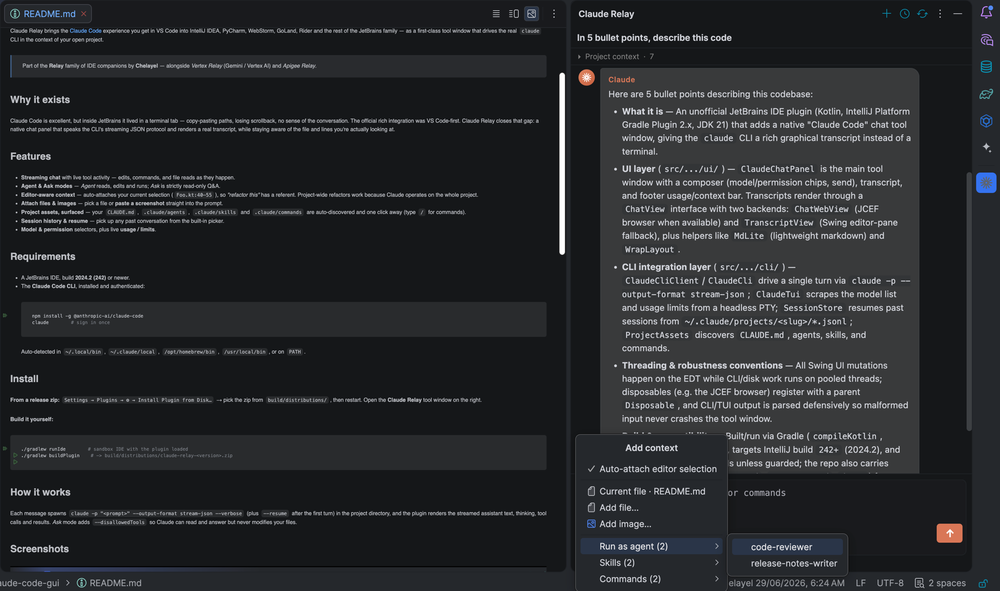
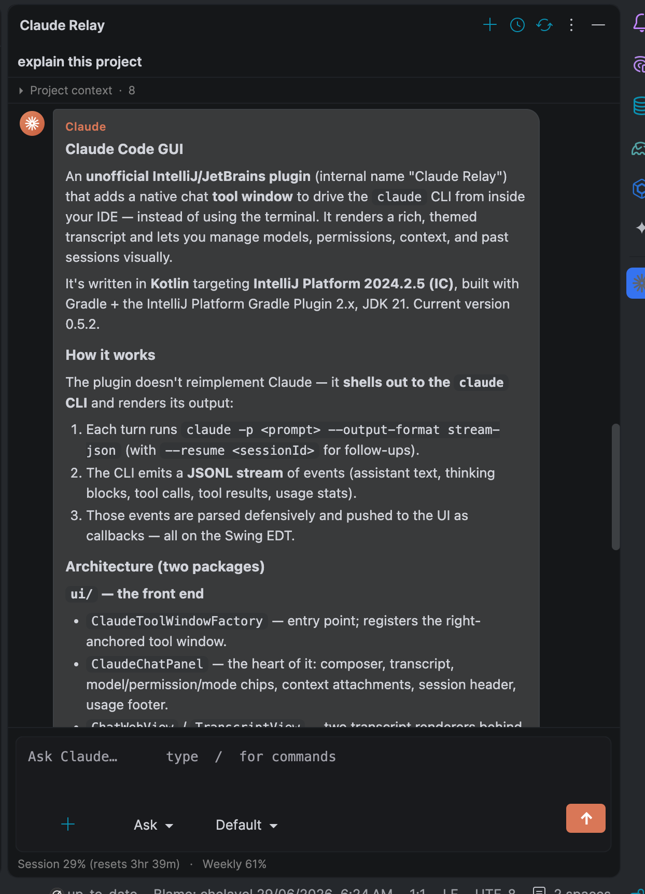
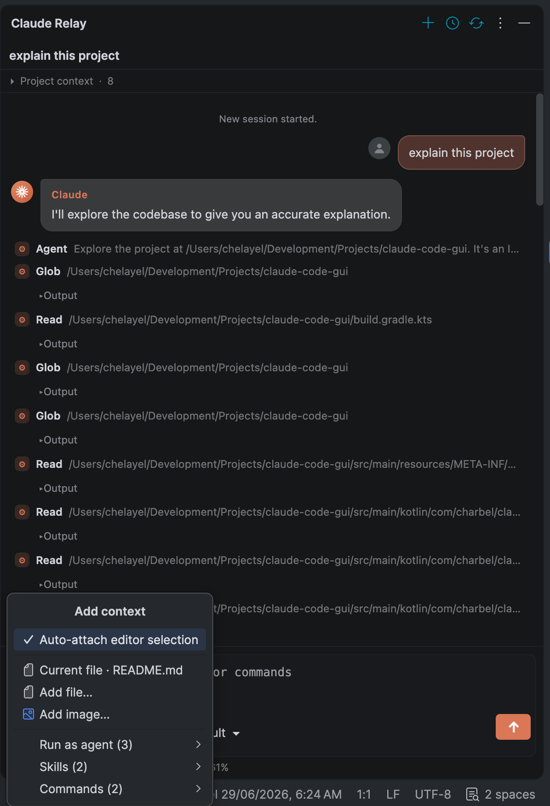
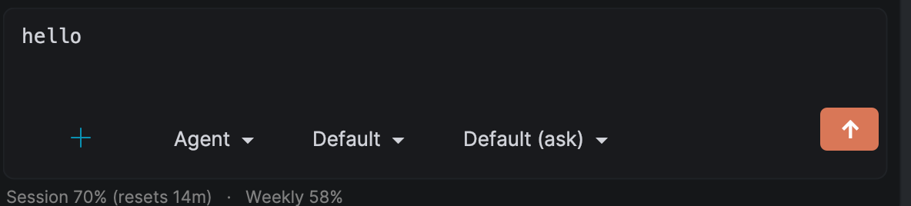

<div align="center">

# Claude Relay

### Claude Code, native in your JetBrains IDE.

**Your `claude` CLI, relayed into a polished side-panel chat — no terminal juggling, no leaving your IDE.**

*An unofficial, independent plugin. Not affiliated with Anthropic.*

</div>

---

Claude Relay brings the [Claude Code](https://claude.com/claude-code) experience you get in VS Code
into IntelliJ IDEA, PyCharm, WebStorm, GoLand, Rider and the rest of the JetBrains family — as a
first-class tool window that drives the real `claude` CLI in the context of your open project.

> Part of the **Relay** family of IDE companions by **Chelayel** — alongside *Vertex Relay* (Gemini /
> Vertex AI) and *Apigee Relay*.

## Why it exists

Claude Code is excellent, but inside JetBrains it lived in a terminal tab — copy-pasting paths,
losing scrollback, no sense of the conversation. The official rich integration was VS Code-first.
Claude Relay closes that gap: a native chat panel that speaks the CLI's streaming JSON protocol and
renders a real transcript, while staying aware of the file and lines you're actually looking at.

## Features

- **Streaming chat** with live tool activity — edits, commands, and file reads as they happen.
- **Agent & Ask modes** — *Agent* reads, edits and runs; *Ask* is strictly read-only Q&A.
- **Editor-aware context** — auto-attaches your current selection (`Foo.kt:40–55`), so *"refactor this"* has a referent. Project-wide refactors work because Claude operates on the whole project.
- **Attach files & images** — pick a file or **paste a screenshot** straight into the prompt.
- **Project assets, surfaced** — your `CLAUDE.md`, `.claude/agents`, `.claude/skills` and `.claude/commands` are auto-discovered and one click away (type `/` for commands).
- **Session history & resume** — pick up any past conversation from the built-in picker.
- **Model & permission** selectors, plus live **usage / limits**.

## Requirements

- A JetBrains IDE, build **2024.2 (242)** or newer.
- The **Claude Code CLI**, installed and authenticated:
  ```bash
  npm install -g @anthropic-ai/claude-code
  claude        # sign in once
  ```
  Auto-detected in `~/.local/bin`, `~/.claude/local`, `/opt/homebrew/bin`, `/usr/local/bin`, or on `PATH`.

## Install

**From a release zip:** `Settings → Plugins → ⚙ → Install Plugin from Disk…` → pick the zip from
`build/distributions/`, then restart. Open the **Claude Relay** tool window on the right.

**Build it yourself:**
```bash
./gradlew runIde        # sandbox IDE with the plugin loaded
./gradlew buildPlugin    # -> build/distributions/claude-relay-<version>.zip
```

## How it works

Each message spawns `claude -p "<prompt>" --output-format stream-json --verbose` (plus `--resume`
after the first turn) in the project directory, and the plugin renders the streamed assistant text,
thinking, tool calls and results. *Ask* mode adds `--disallowedTools` so Claude can read and answer
but never modifies your files.

## Screenshots

<p align="center">
  <br>
  <em>Docked in your IDE — your project's <code>CLAUDE.md</code>, agents, skills and slash commands surfaced as context.</em>
</p>

<p align="center">
  
  &nbsp;&nbsp;
  
</p>
<p align="center">
  <em>A real, themed transcript with live tool activity (left) — and one-click context: current file, selection, files, images, or run-as-agent (right).</em>
</p>

<p align="center">
  <br>
  <em>Compact composer — Agent / Ask mode, model &amp; permission, attachments, and send.</em>
</p>

---

<div align="center">
Built by <b>Chelayel</b> · Unofficial, not affiliated with Anthropic<br>
© 2026 Chelayel — proprietary, all rights reserved. See <a href="LICENSE">LICENSE</a> and <a href="EULA.md">EULA</a>.
</div>
